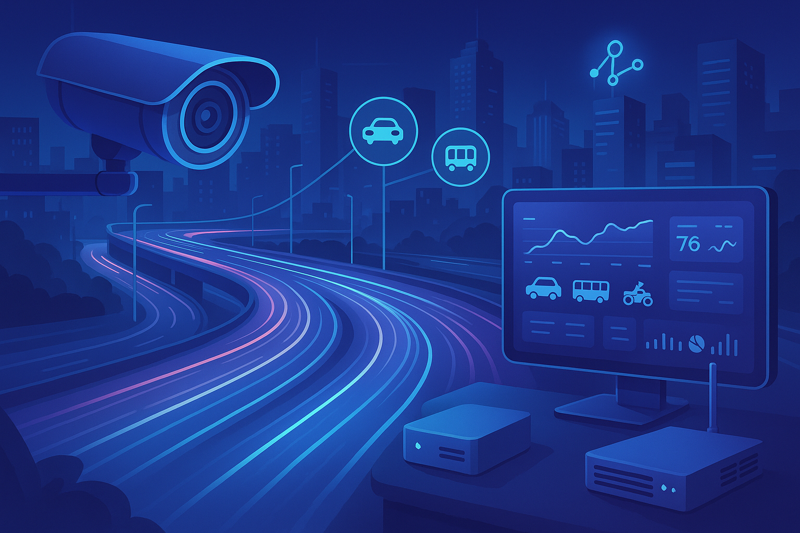

# 📡 Intelligence Automation Smart System

  

    
  

Leverages the advancement of artificial intelligence to build a smart system in the Out-of-Home (OOH) advertising sector, enabling data-driven decision-making, real-time audience analytics, and intelligent content delivery. By integrating computer vision, machine learning, and IoT technologies, the system aims to optimize ad placements, maximize audience engagement, and transform traditional outdoor advertising into a measurable and adaptive medium.

## 🚦 System Architecture: Hub & Site

This system is designed for **vehicle detection using edge and central servers**. The FastAPI backend can be deployed in two environments:

* 🏢 **Main Server** (Cloud or Central Server)
* 📦 **Edge Device** (CCTV + Mini PC/NVIDIA Jetson)

### 🧩 Concept of **Hub**

A **Hub** is a **backend instance**. Each backend deployment equals one Hub. There are two types of Hubs:

#### 1. 🌐 Super Hub (Main Hub)

Deployed on the **central server**. Has full access and acts as **superadmin**. Responsible for **managing and receiving data from all Edge Hubs**. Exposes **APIs to control and receive data** from Edge Hubs.

#### 2. 📡 Edge Hub

Deployed on **edge devices** (e.g., CCTV locations). Responsible for:

  * Local vehicle detection.
  * Sending data to the Super Hub.

It Cannot be managed by normal users — only **syncs data to Super Hub**. Has a local **superuser**, but when syncing to the Super Hub, it behaves as a **normal user**.

### 🗃️ Users & Data Distribution

* 📌 **Superuser in Edge Hub**:

  * Automatically created on deployment.
  * Used for local operations.
  * When sending data to the Super Hub, it's registered there as a **normal user**.

* 📌 **Normal User in Super Hub**:

  * Can create data (e.g., `item`, `site`) but has no admin rights.
  * Helps to **identify the source of the data** sent from each Edge Hub.

### 🏭 Concept of **Site**

A **Site** represents a **CCTV unit** registered under an Edge Hub. Each Edge Hub has **at least one Site**. When a Site is registered:

  * It is also synced to the Super Hub with the associated `owner_id`.
  * Stored in the `site` table in both Edge and Super Hub.

Useful for:

  * Managing multiple CCTVs under a single Edge Hub.
  * Tracking data based on physical location.

### 🔄 Data Sync & Distribution

Entities such as `site` and `item` are automatically synced from Edge Hub to Super Hub. Include a **status flag** to track whether the data has been synced. ⛓️ Each Edge Hub stores information about the Super Hub (endpoint + token).📤 Data is pushed from Edge to Super Hub periodically and automatically.

### 📝 Notes

Currently, there is only **one Super Hub** in the system. Future versions may support **distributing data to multiple Super Hubs**.

## 📃 Documentations

- Backend: [Documentation](./backend/README.md).
- Frontend: [Documentation](./frontend/README.md).
- Frontend Dashboard: [Documentation](./frontend_dashboard/README.md).
- Development: [Development](./development/README.md).

## Release Notes

Go to the [Release Notes](./release-notes.md).

## License

The IASS project is licensed under the terms of the MIT license.
